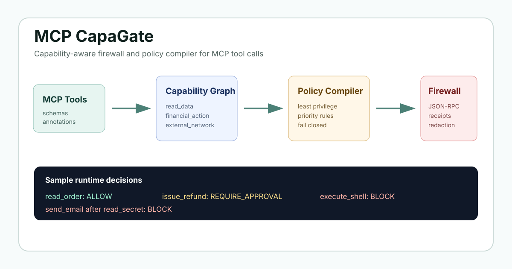

# MCP CapaGate

[](https://github.com/choose-hy/mcp-capagate/actions/workflows/ci.yml)
[](LICENSE)
[](package.json)

Capability-aware firewall and policy compiler for MCP tool calls.

面向 MCP 工具调用的能力图谱、安全策略编译器与运行时防火墙。

[中文 README](README.zh-CN.md)



MCP CapaGate turns MCP tool definitions into a capability graph, compiles least-privilege policies, and blocks risky tool calls before they execute.

This is not another MCP scanner. It is not another chatbot framework. MCP CapaGate is a local-first, deterministic, capability-aware firewall and policy compiler for AI agent tools.

Research-style framing:

> We propose a capability-aware policy compiler for MCP tools that maps tool schemas to a risk graph, synthesizes least-privilege policies, and enforces them at runtime through a deterministic MCP proxy.

No training data required. No fine-tuning required. No proprietary data. No database. No telemetry. No LLM API key.

## Why This Exists

MCP tools give agents power: read files, query databases, send messages, issue refunds, post webhooks, and sometimes execute commands. A normal scanner can list suspicious words. That is useful, but incomplete.

MCP CapaGate asks a stronger question:

> What can this tool do, what can it be chained with, and what policy should exist before an agent calls it?

It converts tool schemas into a Capability Graph, detects drift and attack chains, compiles least-privilege policy, and enforces decisions through a transparent JSON-RPC stdio proxy.

## 30-Second Demo

```bash
pnpm install
pnpm build
pnpm --filter @mcp-capagate/cli capagate demo
```

The demo generates:

- `reports/scan.json`
- `capagate.policy.yaml`
- `reports/summary.md`
- `reports/index.html`
- `.capagate/audit.jsonl`

Example decision output:

```text
read_order: ALLOW
issue_refund: BLOCK - Approval required but not granted
execute_shell: BLOCK
send_email: BLOCK - sensitive read followed by external send
```

## Security Decisions

MCP CapaGate uses four explicit decisions:

- `ALLOW`: forward the call.
- `WARN`: forward and log a warning receipt.
- `REQUIRE_APPROVAL`: require interactive human approval; non-interactive mode blocks.
- `BLOCK`: return a JSON-RPC error without forwarding.

## Capability Graph

Capabilities include:

`read_data`, `write_data`, `delete_data`, `execute_code`, `send_message`, `external_network`, `financial_action`, `identity_access`, `credential_access`, `database_query`, `database_write`, `filesystem_read`, `filesystem_write`, `shell_execution`, `browser_automation`, `admin_action`, `private_data_access`, `cross_system_exfiltration`, `webhook_post`, and `unknown`.

Edges model risky combinations:

- sensitive read followed by external send
- filesystem write followed by shell execution
- private data access
- state mutation
- cross-server tool shadowing

Every graph gets a stable SHA-256 hash for drift detection.

## Policy Compiler

The compiler synthesizes least-privilege policy from the graph:

- allow read-only low-risk tools
- warn on medium-risk or unclear tools
- require approval for private data, financial actions, writes, and external messages
- block shell execution, arbitrary code execution, credential exfiltration, and destructive actions by default

Policy is YAML, deterministic, and human-reviewable.

## Runtime Proxy

`capagate wrap` runs an upstream stdio MCP server behind a transparent firewall:

```bash
capagate wrap --policy capagate.policy.yaml --scan reports/scan.json -- npx @modelcontextprotocol/server-filesystem ./workspace
```

The proxy forwards non-tool JSON-RPC messages unchanged. For `tools/call`, it evaluates policy, optionally checks session attack-chain state, writes a receipt to `.capagate/audit.jsonl`, and fails closed on parse or evaluation errors.

## Tool Drift

Baseline a graph in version control, then compare it in CI:

```bash
capagate diff --baseline .capagate/baseline.json --current reports/scan.json
```

Drift detection flags new tools, removed tools, schema changes, description changes, capability changes, risk changes, and graph hash changes.

## Attack-Chain Detection

MCP CapaGate tracks session-level tool-call memory:

- private or secret read taints a session
- later email, webhook, browser, or external network sink can be blocked
- file write followed by shell execution is treated as persistence risk
- sensitive read after external-network activity is warned or blocked

This is deterministic. It does not require an LLM.

## CLI Usage

```bash
capagate init
capagate discover --input tools-list-response.json --out normalized-tools.json
capagate scan --input examples/refund-server/tools.json --out reports/scan.json
capagate policy --input reports/scan.json --out capagate.policy.yaml
capagate diff --baseline .capagate/baseline.json --current reports/scan.json
capagate report --scan reports/scan.json --policy capagate.policy.yaml --html reports/index.html --markdown reports/summary.md
capagate wrap --policy capagate.policy.yaml -- npx your-mcp-server
capagate demo
```

## GitHub Action

```yaml
- uses: choose-hy/mcp-capagate@v0.1.0
  with:
    config: capagate.yaml
    fail-on: high
    report-dir: reports
```

The action installs dependencies, builds the workspace, runs scan/policy/report, writes the Markdown report to the GitHub step summary, and fails on the configured threshold.

## Examples

- `examples/refund-server`: read order, issue refund, cancel order, send refund email
- `examples/filesystem-server`: read, write, delete, execute shell
- `examples/email-server`: list inbox, send email, forwarding rule
- `examples/poisoned-tools`: synthetic prompt-injection metadata, hidden Unicode, schema comments, and suspicious examples

## Reports

Reports include:

- security posture summary
- capability graph summary
- tool risk matrix
- top critical risks
- policy decisions
- drift findings
- attack-chain findings
- audit timeline
- recommended fixes
- product-facing summary
- developer-facing remediation

## Roadmap

- Ed25519-signed audit receipts
- richer HTTP proxy integration
- server identity pinning
- policy override templates
- optional LLM-assisted explanations that never affect deterministic enforcement
- graph visualization exports

## Security

MCP CapaGate is a guardrail, not a sandbox. Run upstream MCP servers with least-privilege OS permissions. Do not pass real secrets into examples or tests. The MVP redacts common secret and PII patterns in responses, but production deployments should still restrict upstream server permissions.

## License

MIT
